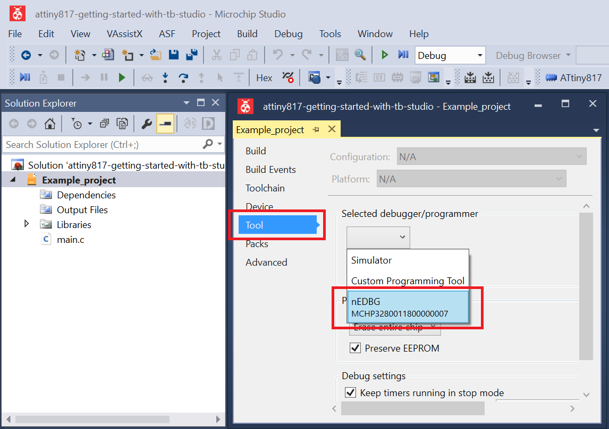

# Generating Constant Analog Signal

This code example shows how to use the Digital-to-Analog Converter (DAC) to generate a constant analog signal on an output pin.

## Related Documentation
More details and code examples on the ATtiny817 can be found at the following links:
- [TB3210-Getting Started with Digital-to-Analog Converter (DAC)](http://ww1.microchip.com/downloads/en/Appnotes/TB3210-Getting-Started-with-DAC-DS-90003210.pdf)
- [ATtiny817 Product Page](https://www.microchip.com/wwwproducts/en/ATTINY817)
- [ATtiny817 Code Examples on GitHub](https://github.com/microchip-pic-avr-examples?q=attiny817)
- [ATtiny817 Project Examples in START](https://start.atmel.com/#examples/ATTINY817XplainedMini)

## Software Used
- Microchip Studio 7.0.2542 or newer [(https://www.microchip.com/mplab/microchip-studio)](https://www.microchip.com/mplab/microchip-studio)
- ATtiny_DFP 1.7.330 or newer Device Pack

## Hardware Used
- ATtiny817 Xplained Mini [(attiny817-xmini)](https://www.microchip.com/developmenttools/ProductDetails/attiny817-xmini)
- Multi-meter

## Setup

The ATtiny817 Xplained Mini Development Board is used as test platform.

 

The following configurations must be made for this project:

System clock: 3.33 MHz

DAC0:
-   Enable DAC to run in Standby mode and with output on pin PA6
-   Disable digital input buffer and the pull-up for pin PA6

VREF:
-   4.34V reference (requires start-up time) selected for DAC

 |Pin                       | Configuration      |
 | :---------------------:  | :----------------: |
 |    PA6 (DAC0_OUT)        |   Analog Output    |

## Operation

 1. Connect the board to the PC.

 2. Open the attiny817-getting-started-with-dac-studio.atsln solution in Microchip Studio.

 3. Set the Generating_Constant_Analog_Signal project as StartUp project. Right click on the project in the **Solution Explorer** tab and click **Set as StartUp Project**.

 

 4. Build the Generating_Constant_Analog_Signal project: Right click on the **attiny817-getting-started-with-dac-studio** solution and select **Build Solution**.

 

 5. Select the **ATtiny817 Xplained Mini** in the Connected Hardware Tool section of the project settings:
   - Right click on the project and click **Properties**
   - Click on the **Tool** tab
   - Select the **ATtiny817 Xplained Mini** (click on the **SN**) in the Selected debugger/programmer section, and save (CTRL + S):

 

 6. Program the project to the board: Click on the **Debug** tab and click **Start Without Debugging**.

 

## Demo

Connect multi-metter probes on pins PA6(+) and GND(-). The measured result `0.542V` is presented below:
 

## Summary

This code example shows how to use the DAC peripheral to generate a constant analog signal on pin PA6.
