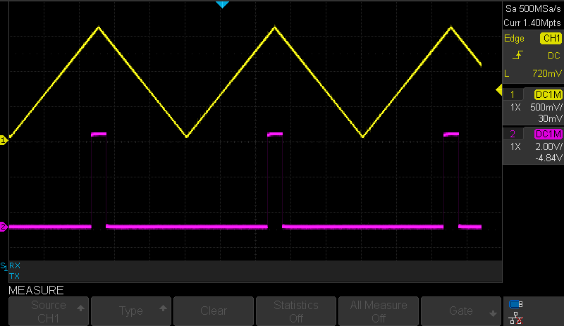
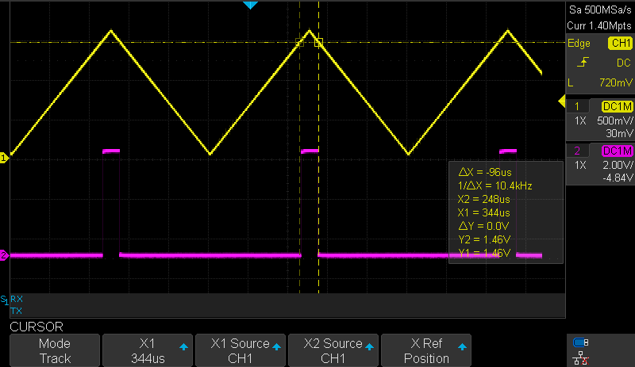

# Using DAC as Negative Input for AC

This application shows how to configure the Digital-to-Analog Converter (DAC) as negative input for the Analog Comparator (AC).

## Related Documentation
More details and code examples on the ATtiny817 can be found at the following links:
- [TB3210-Getting Started with Digital-to-Analog Converter (DAC)](https://ww1.microchip.com/downloads/en/Appnotes/TB3210-Getting-Started-with-DAC-90003210A.pdf)
- [ATtiny817 Product Page](https://www.microchip.com/wwwproducts/en/ATTINY817)
- [ATtiny817 Code Examples on GitHub](https://github.com/microchip-pic-avr-examples?q=attiny817)
- [ATtiny817 Project Examples in START](https://start.atmel.com/#examples/ATTINY817XplainedMini)

## Software Used
- Microchip Studio 7.0.2542 or newer [(https://www.microchip.com/mplab/microchip-studio)](https://www.microchip.com/mplab/microchip-studio)
- ATtiny_DFP 1.7.330 or newer Device Pack

## Hardware Used
- ATtiny817 Xplained Mini [(attiny817-xmini)](https://www.microchip.com/developmenttools/ProductDetails/attiny817-xmini)
- Signal Generator
- Oscilloscope

## Setup

The ATtiny817 Xplained Mini Development Board is used as test platform.

 

The following configurations must be made for this project:

System clock: 3.33 MHz

AC0:
-   Configured to use negative input from DAC and positive input from pin PA7
-   Configured to run in StandBy and Low Power mode and output enabled

DAC0:
-   Enable DAC to run in StandBy mode and with output on pin PA6
-   Disable digital input buffer and the pull-up for pin PA6

VREF:
-   1.5V reference (requires start-up time) selected for DAC

 |Pin                       | Configuration      |
 | :---------------------:  | :----------------: |
 |    PA5 (AC0_OUT)         |   Digital Output   |
 |    PA6 (DAC0_OUT)        |   Analog Output    |
 |    PA7 (AC0 +)           |   Analog Input     |  

## Operation

 1. Connect the board to the PC.

 2. Open the attiny817-getting-started-with-dac-studio.atsln solution in Microchip Studio.

 3. Set the Using_DAC_as_Negative_Input_for_AC project as StartUp project. Right click on the project in the **Solution Explorer** tab and click **Set as StartUp Project**.

 

 4. Build the Using_DAC_as_Negative_Input_for_AC project: Right click on the attiny817-getting-started-with-dac-studio solution and select **Build Solution**.

 

 5. Select the **ATtiny817 Xplained Mini** in the Connected Hardware Tool section of the project settings:
   - Right click on the project and click **Properties**
   - Click on the **Tool** tab
   - Select the **ATtiny817 Xplained Mini** (click on the **SN**) in the Selected debugger/programmer section, and save (CTRL + S):

 

 6. Program the project to the board: Click on the **Debug** tab and click **Start Without Debugging**.

 

## Demo

Connect the Signal Generator probe and the Oscilloscope CH1 probe to the pin PA7(AC+ input), then the Oscilloscope CH2 probe to the pin PA5 (AC Output).
The image below demonstrates the functionality of the AC using the DAC as a negative reference. The triangular waveform input signal is CH1 (yellow), and the AC output signal is CH2 (pink).
  

In the image below, the cursors indicate the switching voltage level for the AC - `~1.46V`. The measured DAC reference voltage value, available on PA6, is `1.44V`.
  

## Summary
This code example illustrates how to configure the DAC as negative input for the AC.
